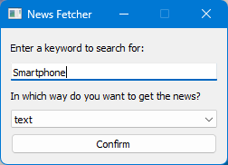
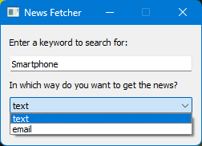
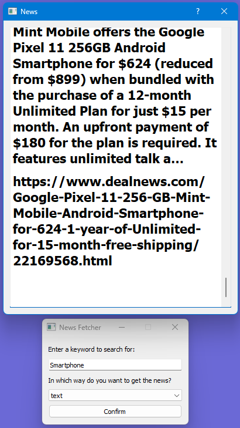
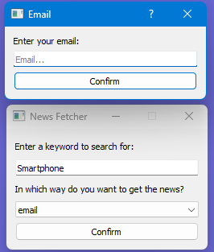
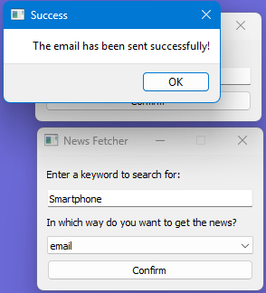
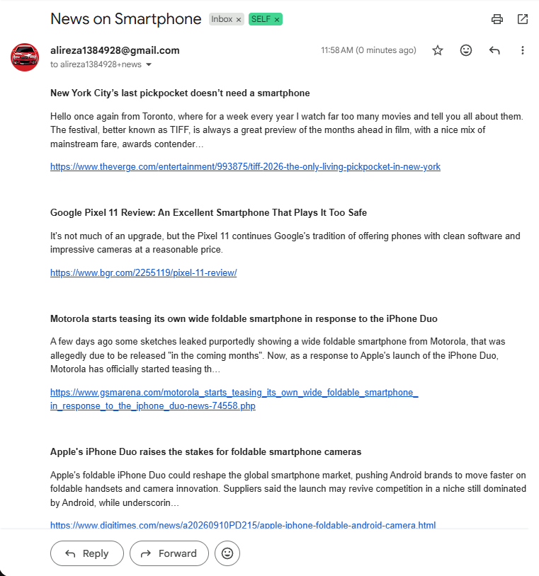

# News Fetcher

A lightweight PyQt5 desktop application that fetches real-time news articles based on custom keywords using NewsAPI, presenting the results directly in a rich-text UI dialog or delivering formatted HTML digests straight to your email.

---

## Application Preview

<p align="center">
   
   
</p>
<p align="center">
   
   
</p>
<p align="center">
   
   
</p>

---

## Features

* Keyword Search: Fetch the latest and most popular news headlines matching any topic directly via NewsAPI.
* Dual Delivery Modes:
  * In-App Viewer: Browse structured HTML news digests instantly inside a dedicated PyQt5 QTextBrowser dialog.
  * Email Dispatch: Send formatted HTML news summaries to any email address using secure SSL-encrypted SMTP.
* Decoupled Architecture: Clean separation between GUI components (PyQt5), API network requests (requests), and email dispatches (smtplib).
* Environment-Based Configuration: Managed credentials for NewsAPI and SMTP server settings via python-decouple.

---

## Tech Stack

* GUI Framework: PyQt5
* HTTP Client: Requests
* API: NewsAPI Everything Endpoint
* Mail Protocol: SMTP with SSL (smtplib, MIMEText)

---

## Getting Started

### Prerequisites
* Python 3.10+
* A free API Key from [NewsAPI.org](https://newsapi.org/)

### Installation

1. Clone the repository:
    ```bash
    git clone https://github.com/Alireza3044/news-fetcher.git
    cd news-fetcher
    ```
   
2. Install dependencies:
    ```bash
    pip install -r requirements.txt
    ```
   
3. Configure environment variables:
   Create a .env file in the root directory:
  
    #### NewsAPI Credentials
    ```env
    API_KEY=your_newsapi_key_here
    ```

    #### SMTP Server Credentials (e.g., Gmail SSL)
    ```env
    SERVER_HOST_NAME=smtp.gmail.com
    SERVER_HOST_PORT=465
    SERVER_EMAIL_USERNAME=your-email@gmail.com
    SERVER_EMAIL_PASSWORD=your-app-password
    ```

4. Run the Application:
    ```bash
    python main.py
    ```
